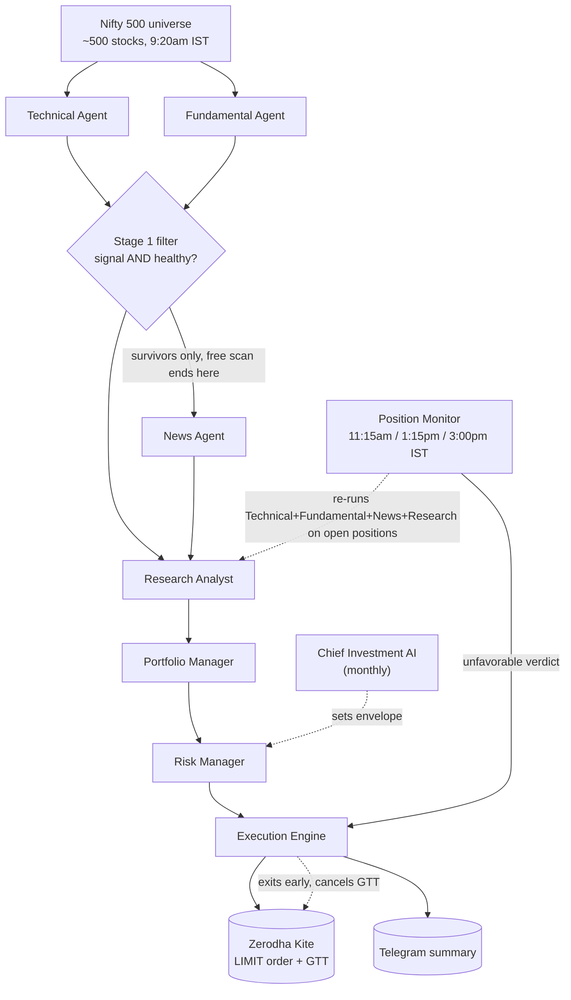

# Stock Trading Bot — Agent Structure & Strategy

A quick reference for how the system is put together: who does what, how a
trading day flows end to end, and the strategy/risk rules underneath it.

## The agent team

| Agent | File(s) | What it does |
|---|---|---|
| Technical Agent | `strategies/technical_agent.py` (+ `ma_crossover.py`, `mean_reversion.py`) | Reads price charts, proposes BUY signals with entry/stop-loss/target |
| Fundamental Agent | `fundamentals/fundamental_agent.py` | Checks the company is financially healthy (debt, ROE, revenue growth) before it's even considered |
| News Agent | `news/news_agent.py` | Reads recent headlines (yfinance + Moneycontrol + Economic Times RSS), asks Claude for a bullish/bearish/neutral read |
| Research Analyst | `research/research_analyst.py` | Combines Technical + Fundamental + News into one verdict per stock: favorable / unfavorable / neutral, with a confidence score |
| Portfolio Manager | `portfolio/portfolio_manager.py` | Confidence-weighted position sizing; when capital is limited, decides which candidates get funded |
| Risk Manager | `risk/risk_manager.py` | Hard, non-negotiable safety limits — max risk per trade, max open positions, max capital deployed, daily loss circuit breaker |
| Execution Engine | `execution/execution_engine.py` | Places real orders via Kite (LIMIT orders), and a GTT stop-loss/target on every buy |
| Chief Investment AI | `cio/chief_investment_ai.py` | The only agent that runs monthly, not daily — reviews last month's result and sets next month's capital/target/active-strategies envelope |

**Supporting infrastructure** (not "agents" in the trading-decision sense, but what makes the above run unattended):

| Piece | File(s) | Purpose |
|---|---|---|
| Automated login | `auth/kite_auto_login.py` | Logs into Kite every morning on its own (TOTP-based) — no manual step |
| Position tracking | `execution/positions.py`, `execution/position_state.py` | Knows what's actually held in the real account across days; reconciles closed positions and logs them |
| Position Monitor | `monitor_positions.py` | Re-runs the same Technical + Fundamental + News + Research Analyst pipeline against *already-open* positions a few times a day, and can exit early if the picture turns unfavorable |
| Scheduler | DigitalOcean VPS, cron | Runs everything automatically — no need for your PC to be on |

## Daily flow

**Two schedules run on the VPS, both unattended:**
- `run_daily.py` — once each morning at **9:20am IST**. Full pipeline above: scans the universe, researches survivors, sizes and places new trades.
- `monitor_positions.py` — three times during market hours (**11:15am, 1:15pm, 3:00pm IST**). Re-checks everything currently held and can exit early on bad news/fundamentals/technicals, on top of the automatic GTT stop-loss/target that's already sitting on every position.

## Strategy & risk rules

**Active strategies** (`config/settings.py` → `ACTIVE_STRATEGIES`):
- `ma_crossover` — trend-following, moving-average crossover. Only takes BUY signals when the broader market (Nifty 50) is itself in an uptrend (the "market regime filter").
- `mean_reversion` — buys dips in range-bound stocks; deliberately *not* gated by the market-regime filter, since it wants choppy/declining conditions.

**Risk limits** (`config/settings.py`):
- 1% of capital risked per trade (distance from entry to stop-loss)
- Max 5 concurrent open positions
- Max 50% of capital deployed at once
- Daily loss circuit breaker at 3% — stops opening new positions for the day if hit

**Why Research Analyst exists**: Technical, Fundamental, and News agents can disagree (e.g. good chart, bad news). Research Analyst is the one place that weighs all three into a single call, rather than each specialist agent acting alone.

**Why Chief Investment AI is separate from Portfolio Manager**: Portfolio Manager makes a decision every time there's a candidate trade (daily cadence). Chief Investment AI runs once a month and sets the *envelope* — how much capital, what target return, which strategies are active — that Portfolio Manager then operates inside. Keeping them separate means one bad month's reasoning can't cause a runaway swing in day-to-day sizing (capital allocation is capped at ±20% month over month).

**Chief Investment AI is now wired up for real** (`monthly_review.py`, scheduled 1st of each month): it reviews last month's *actual* closed trades (`closed_trades_log.csv`, not a backtest stand-in), sets next month's capital cap/target/active strategies, persists that to `data/monthly_plan.json`, and `run_daily.py`/`monitor_positions.py` actually read it — `active_strategies` comes from the plan, and trades are sized against `min(real Kite capital, plan.capital_allocated)`, never past either limit. Sends both the review and the new plan to Telegram.

## Known gaps (honest, not hidden)

- Chief Investment AI's plan doesn't touch `RISK_PER_TRADE_PCT`/`MAX_OPEN_POSITIONS`/`MAX_DEPLOYED_CAPITAL_PCT`/`DAILY_LOSS_CIRCUIT_BREAKER_PCT` — those are still static `config/settings.py` values. Only capital cap and active-strategy selection are CIO-driven so far.
- The Nifty 500 universe list is a point-in-time snapshot (`data/nifty500_constituents.csv`), re-downloaded every few months, not a live feed.
